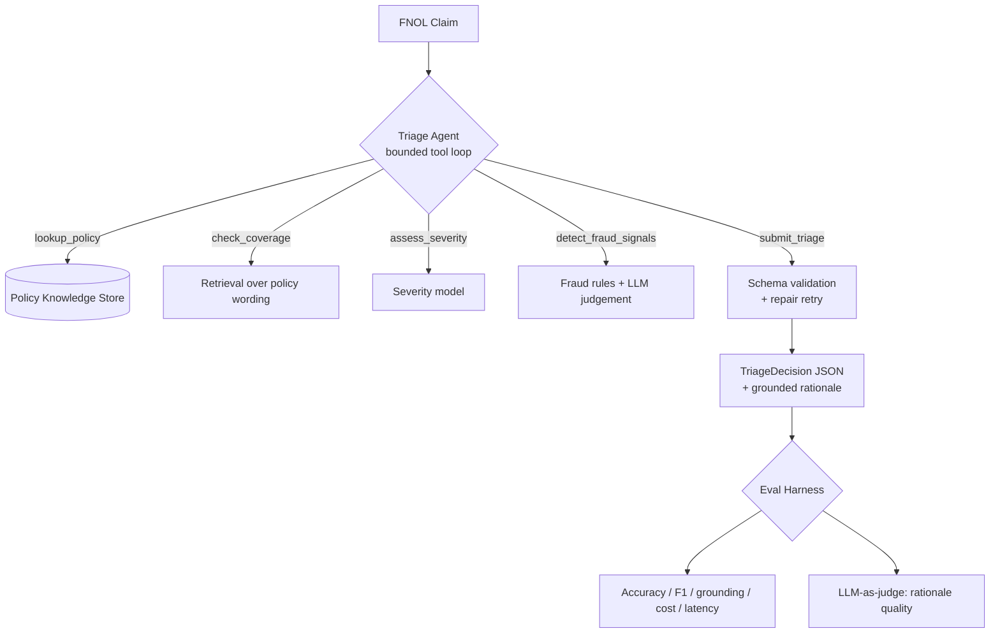

# Architecture

TriageIQ is a **bounded tool-use agent** wrapped in an **evaluation harness**. The design goal
is not just "an agent that works once" but "an agent whose quality you can measure and defend."

## Flow

## Key components

| Module | Responsibility |
|---|---|
| `agent.py` | The loop: cap turns, run tools, validate final output, attach latency/cost/tool-count. |
| `llm.py` | One interface, two backends (real Claude + deterministic mock). Keeps everything runnable offline. |
| `tools.py` | Independently testable capabilities + JSON tool schemas the model sees. |
| `knowledge.py` | Enterprise knowledge: policy records + retrieval. Swap in a vector DB without touching callers. |
| `schemas.py` | Pydantic contracts. The agent's output is *validated data*, not free text. |
| `prompts.py` | Prompt/architecture variants — each is a testable hypothesis. |
| `eval/` | Metrics, grounding (hallucination) guard, LLM-as-judge, variant runner, report. |

## Two production-minded guardrails
1. **Turn cap** — a misbehaving model can never loop forever.
2. **Validate-and-repair** — an invalid `submit_triage` payload triggers one bounded correction
   attempt before failing loudly, instead of shipping malformed data downstream.

## Where it would grow toward production
- Replace keyword retrieval with embeddings + a vector store (interface already isolated).
- Add human-in-the-loop review for `INVESTIGATE`/`SIU` before any customer-facing action.
- Persist runs to a store and track metric drift over time / across model versions.
- Add PII redaction at ingest and an audit log of every tool call and decision.
